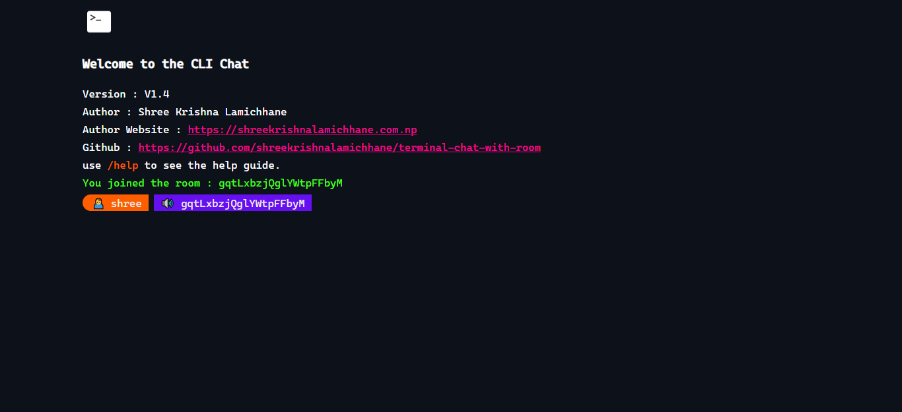

<p align="center">
    <a href="">
        
    </a>
</p>
<h1 align="center" style="border: 0;"> CLI Chat </h1>

**Terminal Chat** is a simple CLI themed realtime chat application developed with NodeJS and socket-io library.

## Table Of Contents

- [Prerequisites](#prerequisites)
- [Installation](#installation)
- [Demo](#demo)
- [Tests](#tests)
- [Author](#author)
- [Contributors](#contributors)
- [Contribution](#contribution)
- [License](#license)
- [Changelog](#changelog)

## Prerequisites

This application uses the following libraries.

- [dotenv](https://github.com/motdotla/dotenv)
- [express](https://github.com/expressjs/express)
- [socket.io](https://github.com/socketio/socket.io)

## Installation

You can clone the whole project.

```
git clone https://github.com/shreekrishnalamichhane/terminal-chat-with-room
```

**OR**

You can `fork` this project.

[](https://github.com/shreekrishnalamichhane/readme/fork)

To install all depenedencies do

```
cd src
npm install
```

Duplicate the `.env.example` file and rename it to `.env` inside `src` folder and fill up the values inside the `.env` file.

To run the project

```
// To start a development server with nodemon
npm run dev

// To run the production server
npm start
```

## Demo


<br>
<br>

Self Hosted Demo: [https://links.shreekrishnalamichhane.com.np/qFeCJ](https://links.shreekrishnalamichhane.com.np/qFeCJ)

## Tests

There are no test avaiable for this project.

## Author

**Author Name** &nbsp; : &nbsp; Shree Krishna Lamichhane <br>
**Author URI** &nbsp; &nbsp; &nbsp; : &nbsp; [shreekrishnalamichhane.com.np](https://shreekrishnalamichhane.com.np) <br>
**GitHub URI** &nbsp; &nbsp; &nbsp; : &nbsp; [shreekrishnalamichhane](https://github.shreekrishnalamichhane.com.np)

## Contributors

There are no contributors on this project right now. You can be one.

## Contribution

Anyone can contribute me on this project. Check the [installation](#installation) section to start contributing to this project.

## License

This project is licensed under MIT License.

[](https://opensource.org/licenses/MIT)

## Changelog

[CHANGELOG.md](CHANGELOG.md)

---

Thank you for visiting. Make sure to try it out. If you love this project give it a star.

[](https://github.com/shreekrishnalamichhane/test)
